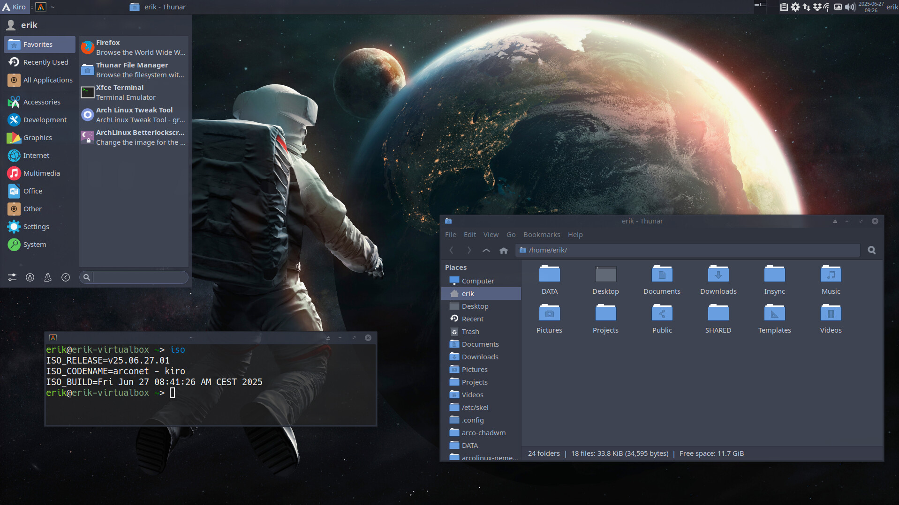

# KIRO ISO





---

## Overview

**KIRO** is a personal, offline Arch Linux ISO builder that creates fully customized installation media. Based on official ArchISO tools and the ArcoLinux project, KIRO enables reproducible builds with pre-configured packages, desktop environments, system optimizations, and custom configurations.

KIRO is designed with specific preferences in mind:

- **Boot Method**: UEFI with systemd-boot
- **Filesystem**: ext4
- **Display Manager**: SDDM with custom theming
- **Desktop Environments**: XFCE4 + Ohmychadwm (tiling window manager)
- **Philosophy**: Free and open-source software

---

## Quick Start

Download the latest KIRO ISO from [SourceForge](https://sourceforge.net/projects/kiro/files/).

Want to build your own? See [Building KIRO](#building-kiro) below.

---

## Features

✅ **Reproducible Builds** — Script-driven, consistent ISO creation  
✅ **Highly Customizable** — Easy to add/remove packages and modify configurations  
✅ **Modern Defaults** — UEFI, systemd, systemd-oomd, performance optimizations  
✅ **Multiple Desktop Environments** — XFCE4 + Ohmychadwm (modern tiling window manager)  
✅ **Pre-configured** — Ready-to-use after installation with Calamares  
✅ **Performance Tuned** — Intelligent task scheduling, memory optimization, system monitoring  
✅ **Educational Foundation** — Comprehensive customization examples and best practices  
✅ **Custom Repository Support** — Chaotic AUR and personal repositories  

---

## What's Included

KIRO comes pre-loaded with:

- **System Tools**: Package management, filesystem utilities, boot loaders (GRUB, systemd-boot, rEFInd)
- **Network**: NetworkManager, VPN support, SSH, wireless tools
- **Desktop Applications**: Firefox, Chromium, Vivaldi, GIMP, Inkscape, VSCode, Sublime Text
- **Media Support**: VLC, FFmpeg, GStreamer with full codec support
- **Development Tools**: Git, build essentials, development libraries
- **Optimizations**: ananicy-cpp task scheduling, systemd-oomd memory management, tuned performance profiles
- **Customization**: Curated fonts, icons, themes, and shell configurations from Nemesis repo

---

## Building KIRO

### Requirements

- **Host System**: Arch Linux or Arch-based distribution
- **Packages**: `archiso` (for mkarchiso)
- **Permissions**: Root access for chroot operations
- **Disk Space**: ~10-15 GB for build environment
- **Knowledge**: Familiarity with Bash scripting and package management

### Getting Started

1. Clone or download this repository
2. Configure packages in `archiso/packages.x86_64`
3. Run the build script from `build-scripts/`
4. Boot the resulting ISO in a VM or on hardware
5. Use Calamares installer to set up your system

For detailed guidance, follow these tutorials:

- **Main Tutorial**: [ArcoLinux ISO Building Guide](https://www.arcolinuxiso.com/a-comprehensive-guide-to-iso-building/)
- **KIRO Video Series**: [KIRO Build Playlist](https://www.youtube.com/watch?v=3jdKH6bLgUE&list=PLlloYVGq5pS71UubmlKjjw131PjixMIjW)
- **Companion Project**: [BUILDRA (based on KIRO)](https://github.com/buildra)

---

## Project Structure

```
kiro-iso/
├── archiso/                        # Core ISO build configuration
│   ├── airootfs/                   # Root filesystem overlay
│   │   ├── etc/                    # System configuration files
│   │   ├── usr/                    # User-space binaries and data
│   │   └── root/                   # Root user scripts and configs
│   ├── packages.x86_64             # Package list for x86_64 architecture
│   ├── packages.bootstrap          # Minimal bootstrap package set
│   ├── profiledef.sh               # ISO profile definition and metadata
│   ├── pacman.conf                 # Package manager and repository config
│   └── boot/                       # Boot loader configurations
│       ├── grub/                   # GRUB (legacy BIOS)
│       ├── syslinux/               # Syslinux boot
│       └── efiboot/                # EFI boot files
├── build-scripts/                  # Automated build processes
├── enable-oomd.sh                  # Post-installation OOM daemon setup
├── disable-oomd.sh                 # Disable OOM daemon
├── change-version.sh               # Version management utility
├── up.sh                           # Update and maintenance script
└── personal_repo/                  # Local package repository
```

---

## Technical Details

### System Configuration

#### Boot & Initialization

- **Boot Methods**: UEFI (primary), GRUB (legacy BIOS), Syslinux (alternative)
- **Boot Loader**: systemd-boot (default UEFI), GRUB (legacy)
- **Init System**: systemd with cgroups-v2 support
- **Filesystem**: ext4 (default)

#### Memory & Performance Management

- **systemd-oomd**: Out-of-Memory daemon with proactive memory management
  - 20-second reaction time with 60% memory pressure threshold
  - Memory pressure monitoring enabled
  - Graceful overflow handling
- **ananicy-cpp**: Intelligent task scheduling with CachyOS rules
- **tuned**: Performance profile manager
- **zram-generator**: Compressed RAM swap for memory efficiency

#### Display & Desktop

- **Display Manager**: SDDM with custom themes (multiple variants)
- **Primary DE**: XFCE4 with extensive customization
- **Window Manager**: Ohmychadwm (modern tiling WM with integrated menu system)
- **Themes**: Arc GTK (with Dawn/Mint variants), Neo-Candy collection
- **Icons**: Numix, Sardi, Surfn, Candy Icons
- **Cursors**: Bibata, Vimix, Beautyline

### Package Categories

#### System Utilities

- Core: `base`, `base-devel`, `linux`, `linux-headers`
- Live System: `archiso`
- Filesystems: `btrfs-progs`, `ntfs-3g`, `exfatprogs`, `dosfstools`
- Monitoring: `btop`, `glances`, `inxi`, `lm_sensors`, `systemd-devel`

#### Installation & System Recovery

- **Calamares**: Modern graphical installer with modular architecture
- **kiro-calamares-config**: Custom Calamares modules and workflows
- **Recovery Tools**: `clonezilla`, `fsarchiver`, `partclone`, `gparted`
- **Disk Utilities**: `parted`, `gptfdisk`, `fdisk`, `testdisk`

#### Network & Connectivity

- **Management**: NetworkManager with graphical frontends
- **VPN**: OpenConnect, OpenVPN, VPNC, PPTP support
- **DNS/DHCP**: Bind, dnsmasq, nss-mdns, Avahi
- **Wireless**: iwd, wpa_supplicant, wireless-regdb
- **SSH**: OpenSSH, secure remote management

#### Desktop Applications

- **Browsers**: Firefox, Chromium, Vivaldi
- **Media**: VLC, FFmpeg, GStreamer (with all plugins)
- **Graphics**: GIMP, Inkscape, ImageMagick, Nomacs
- **Development**: VSCode, Sublime Text, Git, meld, build-essential
- **Communication**: Signal Desktop, Shortwave
- **Utilities**: qBittorrent, yt-dlp, Simple Scan, file-roller

#### Audio & Video

- **Audio**: PulseAudio, ALSA, pavucontrol
- **Bluetooth**: Bluez, Blueberry (manager)
- **Video**: Mesa (open-source), NVIDIA open drivers
- **Codecs**: gst-libav, libdvdcss, complete GStreamer plugin suite

#### Fonts & Typography

- **Font Families**: Noto Fonts, DejaVu, Ubuntu, Roboto, Hack, JetBrains Mono, Meslo Nerd Font
- **CJK Support**: Adobe Han Sans (Japanese, Korean, Chinese)
- **Icon Fonts**: Material Design, various Nerd Font variants

#### AUR & Custom Repositories

- **Chaotic AUR**: Precompiled packages from Arch User Repository
- **Nemesis Repository** (custom): Educational configurations and customizations
  - `edu-dot-files-git`: Pre-configured shell and application settings
  - `edu-xfce-git`: XFCE4 customization package
  - `edu-shells-git`: Custom shell configurations
  - `edu-rofi-git` + `edu-rofi-themes-git`: Application launcher with themes
  - `edu-polybar-git`: Custom status bar
  - `ohmychadwm-git`: Modern tiling window manager with integrated menu
  - `edu-variety-config-git`: Wallpaper manager presets
- **AUR Helpers**: `paru-git`, `yay-git`
- **Utilities**: `downgrade` (package downgrading)

### Build System

#### Build Process

1. **Configuration Phase**: Define packages in `archiso/packages.x86_64`
2. **Build Phase**: Execute build scripts using mkarchiso
3. **Customization Phase**: Apply overlays from `airootfs/`
4. **Finalization**: Create bootable ISO with boot loader configurations
5. **Testing Phase**: Verify ISO in VM or on hardware

#### Key Scripts

- **build-scripts/**: Automated build orchestration
- **up.sh**: Update and rebuild utilities
- **enable-oomd.sh**: Post-installation systemd-oomd setup with tuned parameters
- **disable-oomd.sh**: Disable systemd-oomd if needed
- **change-version.sh**: Version string management

#### Configuration Files

- **archiso/profiledef.sh**: ISO metadata, label, architecture definition
- **archiso/pacman.conf**: Repository sources and package signing
- **archiso/airootfs/etc/**: System configuration overlays

### Custom Repository

KIRO packages can be accessed via:

```ini
[kiro_repo]
SigLevel = Never
Server = https://kirodubes.github.io/$repo/$arch
```

---

## Recent Changes

- **Calamares**: Migrated from GitHub to Codeberg (new pkgbuild)
- **Deprecation**: `kiro-system-installation` package removed (functionality moved to Calamares modules)
- **Enhancement**: `kiro-calamares-config` refactored with modular approach
- **Optimization**: systemd-oomd configuration improved for stability and performance

For detailed video tutorials on these changes and build processes, see:
- [KIRO Build Basics](https://youtu.be/3jdKH6bLgUE)
- [Advanced Customization](https://youtu.be/mH52To8DvlI)

---

## Resources

- **Official Arch Wiki**: [ArchISO](https://wiki.archlinux.org/title/Archiso)
- **ISO Building Guide**: [ArcoLinux Comprehensive Guide](https://www.arcolinuxiso.com/a-comprehensive-guide-to-iso-building/)
- **KIRO Video Series**: [YouTube Playlist](https://www.youtube.com/watch?v=3jdKH6bLgUE&list=PLlloYVGq5pS71UubmlKjjw131PjixMIjW)
- **Related Project**: [BUILDRA](https://github.com/buildra) — A derivative project based on KIRO

---

## License

KIRO is built on open-source tools and components. Refer to individual package licenses for details.

---

**For questions or contributions**, refer to the video tutorials and official Arch Linux documentation.

*Live long and prosper.* 🖖
